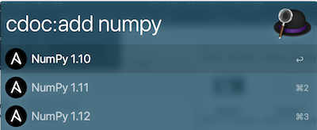
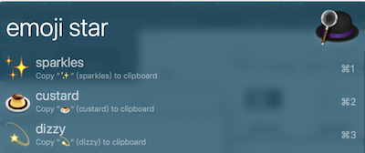
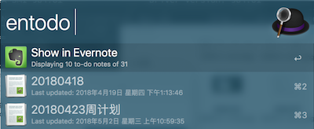

# AlfredWorkflow
Some Workflow files for Alfred3.

本人收集的一些Alfred Workflow，已测试运行正常。

## 目录
- [chrome_bookmarks](#chrome_bookmarks)
- [CodeVar](#CodeVar)
- [devdocs](#devdocs)
- [emoji](#emoji)
- [encode-decode](#encode-decode)
- [Evernote](#Evernote)
- [github](#github)
- [ip-address](#ip-address)
- [mail-app-search](#mail-app-search)
- [stack-overflow](#stack-overflow)
- [sublime-text](#sublime-text)
- [terminal-finder](#terminal-finder)

## chrome_bookmarks
搜索chrome浏览器的书签。  

## CodeVar
[DOWNLOAD](https://github.com/Subenle/AlfredWorkflow/raw/master/CodeVar/CodeVar.alfredworkflow)  
生成变量/函数名，可生成：
  
- xt: 小驼峰 loadConfiguration
- dt: 大驼峰 LoadConfiguration
- xh: 下划线 load_configuration
- cl: 常量 LOAD_CONFIGURATION

## devdocs
[DOWNLOAD](https://github.com/Subenle/AlfredWorkflow/raw/master/CodeVar/CodeVar.alfredworkflow)  
查询技术文档：http://devdocs.io/  
首先需要通过`cdoc:add`添加相关的语言  

然后就可以直接用语言进行搜索，搜索后会跳转到上述网站上的对应页面

## emoji
[DOWNLOAD](https://github.com/Subenle/AlfredWorkflow/raw/master/CodeVar/CodeVar.alfredworkflow)  
查询并复制emoji表情，可进行模糊搜索，但是有些不太好搜，比如one

## encode-decode
[DOWNLOAD](https://github.com/Subenle/AlfredWorkflow/raw/master/CodeVar/CodeVar.alfredworkflow)  
编码、译码各种字符  

- 编码  

- 译码  

## Evernote
[DOWNLOAD](https://github.com/Subenle/AlfredWorkflow/raw/master/CodeVar/CodeVar.alfredworkflow)  
搜索印象笔记（Evernote）中的笔记`en`、待做事项`entodo`等。  
  
  

## github
[DOWNLOAD](https://github.com/Subenle/AlfredWorkflow/raw/master/CodeVar/CodeVar.alfredworkflow)  
github官方出品workflow，`gh > login`后，输入`gh`即可出现自己的项目，也可搜索github上的项目。  

## ip-address
[DOWNLOAD](https://github.com/Subenle/AlfredWorkflow/raw/master/CodeVar/CodeVar.alfredworkflow)  
输入`ip`就会显示本机局域网ip，和外网ip。  
  

## mail-app-search
[DOWNLOAD](https://github.com/Subenle/AlfredWorkflow/raw/master/CodeVar/CodeVar.alfredworkflow)  
搜索`em`mac自带的邮箱客户端内的邮件，可按作者`emfrom`、主题`emsubj`、附件`ema`等进行搜索。  
  

## stack-overflow
[DOWNLOAD](https://github.com/Subenle/AlfredWorkflow/raw/master/CodeVar/CodeVar.alfredworkflow)  
搜索stackOverf中的帖子。  
  

## sublime-text
[DOWNLOAD](https://github.com/Subenle/AlfredWorkflow/raw/master/CodeVar/CodeVar.alfredworkflow)  
用sublime-text打开文件（夹）。  
  

## terminal-finder
[DOWNLOAD](https://github.com/Subenle/AlfredWorkflow/raw/master/CodeVar/CodeVar.alfredworkflow)  
- if: 用finder打开当前iterm所在的目录
- tf：用finder打开当前Terminal所在的目录
- fi：在iterm中进入当前finder所在的目录
- ft：在Terminal中进入当前finder所在的目录

感觉对于程序员来说，这个flow很好用。不用先查看文件属性，拷贝路径，再打开终端，cd到文件目录。  
看如下两个图，设置的图标一目了然。  
  

